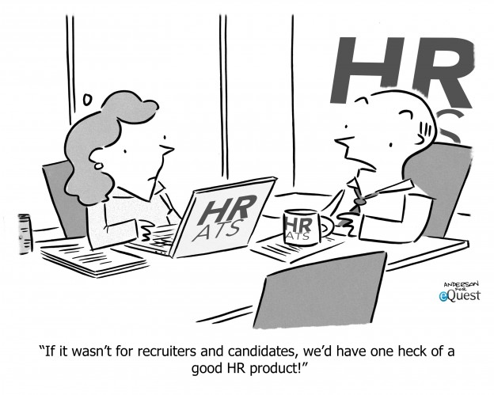

# Pravilno korišćenje

Pod pravilnim korišćenjem ATS podrazumeva se pre svega nekoliko stavki.

Naime, ukoliko u procesu selekcije postoji više krugova potrebno je da se pravilno organizuje i rasporedi tim na način kako je organizovan proces selekcije od strane HR-a. U ovom slučaju, simulacija procesa selekcije i rad sa timom koji će biti zadužen u procesu testiranja kandidata je nešto što se podrazumeva kako bi se izbegle neprijatne situacije. 

U pogledu regrutera i ostalih korisnika van tehničkog tima, potrebno je da budu razrađeni sistemi za odgovoranje, slanje poruka. Dakle, ukoliko kandidat pošalje generalnu aplikaciju potrebno je da postoji email template koji će mu odgovoriti da je njegova aplikacija primljena. Ono što bi bilo idealno jeste da se takve aplikacije stavljaju u određenu zasebnu baza gde će po potrebi biti kontaktirani. Pre svega, pre otvaranja konkursa za poziciju za koju možda imate nekog ko se ranije prijavio, uvek je potrebno da se pregledaju dostavljeni CV-evi i zatim kontaktiraju ti kandidati prvo. Na taj način kompanija šalje poruku  o profesionalnosti i da za cilj ima da pronađe ljude sa kojima može da dalje napreduje. 

Nikad ne koristite isti template za različite pozicije. Ne samo što izgleda neprofesionalno već šalje i pogrešnu poruku da HR ne razmišlja prilikom slanja poruka već samo radi ka tome da se što pre reši procesa odgovoranja kandidatima. Iako je ćutanje loše, slanje istih poruka je još gore. Naročito kada je reč o manjem broju kandidata i kada nije reč o ogromnoj organizacionoj strukturi. 

Uz svaki proces selekcije kandidata potrebno je objasniti timu da moraju da ostave svoje komentare, te zatim dokaze o završenim testovima, zadacima i slično. Na taj način postoji dosije kandidata na jednom mestu.

Ono što ATS još nudi jeste da uvek imate pregled svih kandidata. To što kandidat nije jednom prošao proces selekcije ne znači da neće moći da u jednom trenutku isti prođe. Sam proces neki put nije zavisan toliko od znanja koliko od spleta događaja koji se mogu desiti i uticati na loš rezultat. U jednom momentu može da se desi da se otvori pozicija koja bi odgovarala kandidatu koji je pokazao želju za radom i koji je možda imao loš dan u pogledu tehničkog testiranja. Pre svega, pre raspisivanja oglasa potrebno je doći i kontaktirati kandidata i pitati ga da li je zainteresovan da ponovo pokuša i da uz mentorstvo drugih napreduje u svom profesionalnom razvoju uokviru kompanije.

Sam posao HR-a ne prestaje kada se završi selekcija. Zakon o zaštiti podataka o ličnosti u članu 32 govori i o mogućnosti prenosa podataka. Naravno, prilikom dostavljanja podataka, CV, prvobitni rukovalac koji je u ovom slučaju ujedno i obrađivač \(kompanija\) može uvek uz kontaktiranje kandidata da taj podatak ustupi drugom rukovaocu. Zašto je ovo bitno? Posao HR-a ne završa se u procesu selekcije kandidata za svoju kompaniju. Ukoliko je neko dobar kandidat, koji ne odgovara profilu kakav vaša kompanija traži, zašto ga ne proslediti drugom kadrovskom odeljenju, kompaniji? HR pre svega treba da pomogne ljudima oji traže zaposlenje ukoliko je to naravno moguće. Druge kadrovske službe nisu neprijatelji i saradnje je poželjna. Što se tiče samog kandidata pokazujete da ste HR u pravom smislu i da osobe ne doživljavate kao jednostavni resurs. Na taj način, gradite svoju prepoznatljivost kao i prepoznatljivost firme koja brine o ljudima. Takva slika uvek može da pozicionira kompaniju na tržistu mnogo bolje u odnosu na ostale kompanije. 

Još jedna stvar koju je potrebno izbegavati jeste korišćenje AI sistema za automatizovanu obradu podataka i selekciju kandidata. Pre svega, po Zakonu o zaštiti podataka o ličnosti, kandidat mora da bude obavešten da takav sistem postoji, zatim u članu 38 stav 1 jasno se navodi da bilo kakva odluka doneta od strane automatizovanog sistema ne može biti primenjena na kandidata ako proizvodi određene posledice. Takođe kandidat u svakom momentu ima pravo prigovora i da traži da se lično odluči o njegovom CV-u. Jednostavno govoreći, ovakvi sistemi dovode do prevelikog utroška vremena, mogu biti krajnje neefikasni a pre svega krajnje nefer. 

